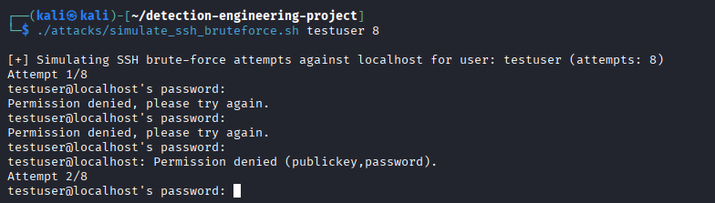
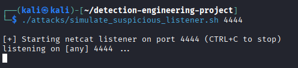
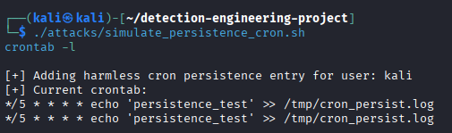
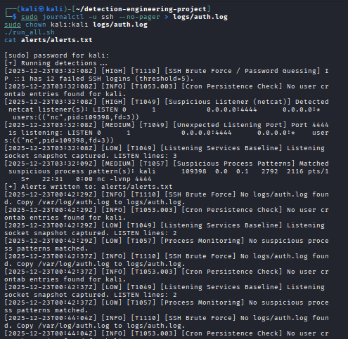

# Detection Engineering & MITRE ATT&CK–Mapped Security Monitoring

## Overview
This project demonstrates **detection engineering on a Linux host** by building and validating **custom security detections** mapped to the **MITRE ATT&CK framework**.  
Realistic attacker behaviors are simulated, and **SOC-style alerts** are generated using native Linux telemetry on a single Kali Linux virtual machine.

---

## Objectives
- Simulate realistic attacker techniques
- Design custom host-based detections
- Map detections to MITRE ATT&CK techniques
- Generate severity-based alerts
- Document detections in a SOC-style playbook

---

## Tools & Technologies
- **OS:** Kali Linux
- **Scripting:** Bash
- **Framework:** MITRE ATT&CK
- **Telemetry:** SSH logs, processes, network sockets, cron
- **Utilities:** ss, ps, grep, awk, journalctl, nc

---

## MITRE ATT&CK Coverage

| Technique ID | Technique Name | Detection Description |
|-------------|---------------|-----------------------|
| T1110 | Brute Force | SSH password guessing detection |
| T1049 | System Network Connections Discovery | Unauthorized listening service detection |
| T1057 | Process Discovery | Suspicious process command-line detection |
| T1053.003 | Scheduled Task / Cron | Persistence via cron job detection |

---

## Project Structure

```text
detection-engineering-project/
├── attacks/        # Attack simulation scripts
├── detections/     # Detection logic (MITRE-mapped)
├── alerts/         # Generated alerts (sample output)
├── report/         # Detection playbook
├── screenshots/    # Project screenshots
├── run_all.sh      # One-click detection runner
└── README.md
```
---

## Attack Simulation
SSH Brute Force Simulation (T1110)

## SSH Brute Force Simulation (T1110)

Repeated failed SSH login attempts are generated against the local system to simulate **password guessing / brute-force behavior**.

<p align="center">
  
</p>

---

## Unauthorized Netcat Listener (T1049)

A suspicious network listener is created on a **non-standard port** using `netcat`, simulating unauthorized service exposure.

<p align="center">
  
</p>

---

## Persistence via Cron Job (T1053.003)

A benign cron job is added to simulate **persistence through scheduled tasks**.

<p align="center">
  
</p>

---

## Detection Output (SOC-Style Alerts)

Custom detections generate **timestamped, severity-based alerts** mapped to MITRE ATT&CK techniques.

<p align="center">
  
</p>

Example alert:

[HIGH] [T1110] SSH Brute Force / Password Guessing detected

---

How to Run

```bash
./run_all.sh
```

This script:

Collects system telemetry

Executes all detection rules

Writes alerts to alerts/alerts.txt

---

## Detection Playbook

A detailed SOC-style detection playbook is included:

report/detection_playbook.md


It documents detection logic, MITRE mapping, validation steps, and response recommendations.

---

## Key Skills Demonstrated

- Detection Engineering

- MITRE ATT&CK Mapping

- Linux Host Security Monitoring

- Attack Simulation & Validation

- SOC-style Alerting

- Bash Scripting

---

## Conclusion

This project reflects real-world blue team and detection engineering workflows by combining attacker simulation, host telemetry analysis, and MITRE ATT&CK–aligned alerting in a clean and reproducible manner.

---

## Author

Sharada Rani
Master’s Student – Cybersecurity
